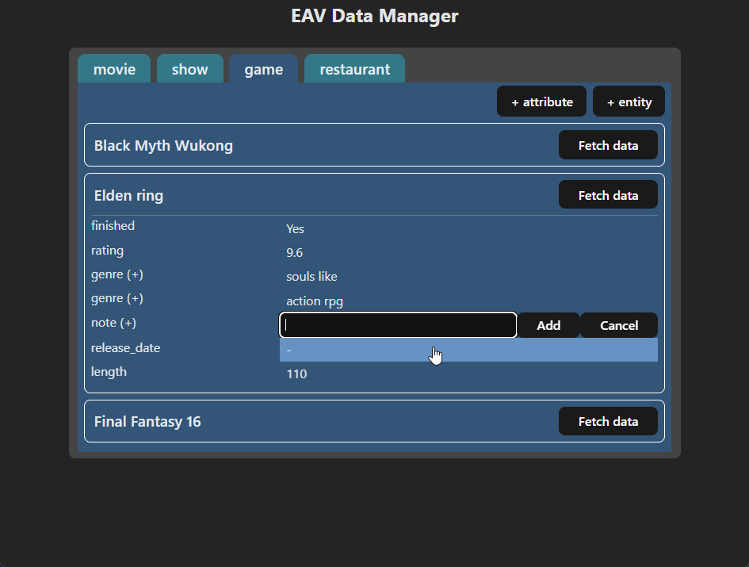

# EAV Table App

Run the setup script to setup a local database with a basic Entity Attribute Value (EAV) system.

As a personal project, I also built a basic REST app around the EAV database to hopefully make 
editing and retrieving data easier.

## SQL Script

- Includes utility stored procedures for ease of use
- Includes utility views for ease of use

### Adding entries
1. create entity/entity type
`call create_eav_entity(entity_name, entity_type);`

2. create attribute linked to entity type
`call create_eav_attr(attr_name, attr_type, entity_type_id, allow_multiple);`

3. (optional) view attribute definitions for existing entity types
`select * from eav_schema_definitions;`

4. create value for entity/attribute
`call create_eav_value(entity_id, attr_id, ...value);`

5. (optional) view all existing entities, all possible attributes per entity, and values if exist
`select * from all_possible_eav_data;`

6. (optional) view only values inserted into the EAV table
`select * from all_existing_eav_data;`

## Java App

Basic springboot/sql2o application with a database interaction package layer 
built for the SQL EAV system created through the SQL script.

## Web Client

Basic vite/react application for interfacing with the java API.

## Build Instructions

In order for the launch.bat file to work, the java and the react project must be built.
- In intellij maven tab -> Lifecycle -> package
- `cd /client && npm run build`

Note: launch_dev.bat requires the java project to be built as well